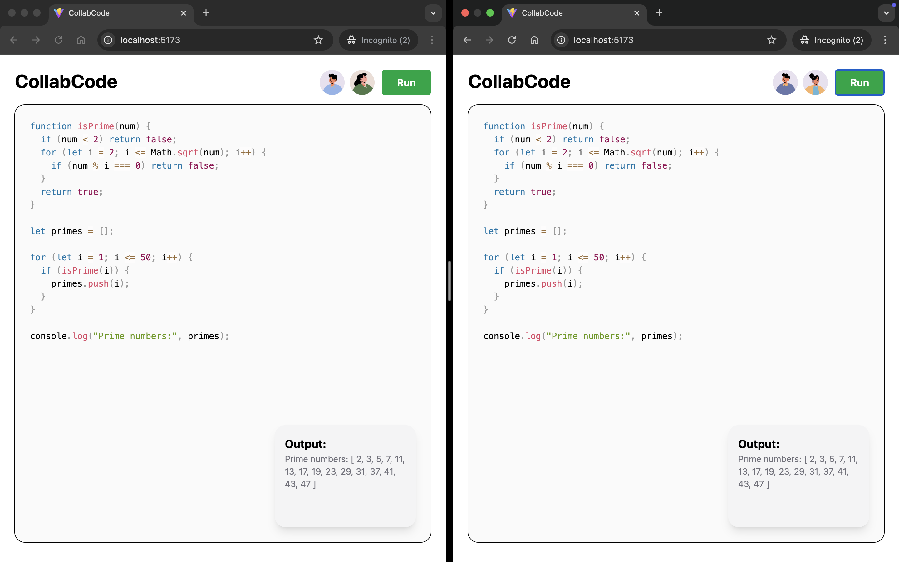

# CollabCode

**Web-Based Real-Time Collaborative JavaScript Editor**



## 🚀 Project Overview

CollabCode is a modern, web-based JavaScript editor that enables multiple users to code simultaneously in real-time via their browsers. Built with cutting-edge web technologies, it provides a seamless collaborative coding experience with professional-grade features.

## ✨ Features

### 🔄 **Real-Time Collaboration**

- **Live Updates**: See changes from other users in real-time
- **Multi-User Support**: Multiple developers can code simultaneously
- **WebSocket Integration**: Instant synchronization across all connected clients

### 💻 **Advanced Code Editor**

- **Syntax Highlighting**: Professional JavaScript syntax highlighting with Prism.js
- **Real-Time Typing**: Instant feedback as you code
- **Multi-Language Support**: JavaScript, TypeScript, JSX, and TSX
- **Responsive Design**: Works seamlessly on all device sizes

### 🎨 **User Experience**

- **Modern UI**: Clean, intuitive interface built with NextUI and Tailwind CSS
- **Avatar System**: Visual representation of team members
- **Offline Editing**: Continue coding even when connection is lost
- **Drag & Drop**: Easy file management and organization

### 🛠 **Developer Tools**

- **In-Browser Execution**: Run and preview code directly in the browser
- **Error Handling**: Comprehensive error reporting and debugging
- **Performance Optimized**: Fast, responsive editing experience

## 🏗 Architecture

### **Frontend**

- **React 19** with TypeScript for type safety
- **NextUI** for modern, accessible UI components
- **Tailwind CSS** for responsive, utility-first styling
- **Prism.js** for professional syntax highlighting

### **Backend**

- **Node.js** with Express for robust server-side logic
- **WebSocket** implementation for real-time communication
- **CORS** enabled for cross-origin collaboration

### **Real-Time Communication**

- **WebSocket Server**: Handles multiple client connections
- **Event-Driven Updates**: Efficient broadcasting of code changes
- **Connection Management**: Automatic reconnection and state synchronization

## 🚀 Getting Started

### **Prerequisites**

- Node.js 18+
- npm or yarn package manager

### **Installation**

1. **Clone the repository**

   ```bash
   git clone <repository-url>
   cd CollabCode
   ```

2. **Install dependencies**

   ```bash
   # Install backend dependencies
   cd backend
   npm install

   # Install frontend dependencies
   cd ../frontend
   npm install
   ```

3. **Start the development servers**

   ```bash
   # Start backend (from backend directory)
   npm start

   # Start frontend (from frontend directory)
   npm run dev
   ```

4. **Open your browser**

   - Frontend: http://localhost:5173
   - Backend: http://localhost:3001

## 🔧 Development

### **Project Structure**

```
CollabCode/
├── backend/           # Node.js + Express + WebSocket server
├── frontend/          # React + TypeScript + Vite application
│   ├── src/
│   │   ├── components/    # Reusable UI components
│   │   │   └── CodeEditor.tsx  # Syntax-highlighted code editor
│   │   ├── App.tsx        # Main application component
│   │   └── main.tsx       # Application entry point
│   └── package.json
└── README.md
```

### **Key Components**

#### **CodeEditor Component**

- **Syntax Highlighting**: Real-time JavaScript/TypeScript highlighting
- **Dual-Layer Architecture**: Hidden input with visible highlighted output
- **Responsive Design**: Adapts to different screen sizes
- **Performance Optimized**: Efficient rendering and updates

#### **Real-Time Collaboration**

- **WebSocket Integration**: Instant code synchronization
- **State Management**: Efficient handling of multiple user inputs
- **Error Recovery**: Graceful handling of connection issues

## 🌟 Future Enhancements

- [ ] **Advanced Theming**: Multiple color schemes and customization options
- [ ] **File Management**: Drag-and-drop file organization
- [ ] **Service Workers**: Enhanced offline capabilities
- [ ] **Redux Integration**: Advanced state management
- [ ] **CodeMirror Integration**: Professional-grade editor features
- [ ] **Real-Time Chat**: Built-in team communication
- [ ] **Version Control**: Git integration and commit history

## 🤝 Contributing

We welcome contributions! Please feel free to submit issues, feature requests, or pull requests.

### **Development Guidelines**

- Follow TypeScript best practices
- Maintain consistent code formatting
- Write meaningful commit messages
- Test thoroughly before submitting

## 📄 License

This project is licensed under the MIT License - see the LICENSE file for details.

## 🙏 Acknowledgments

- **Prism.js** for excellent syntax highlighting
- **NextUI** for beautiful, accessible UI components
- **Tailwind CSS** for utility-first CSS framework
- **React Team** for the amazing framework

---

**Built with ❤️ for collaborative coding**
